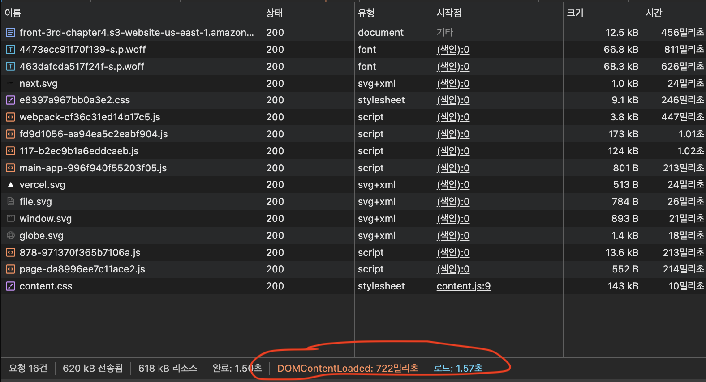
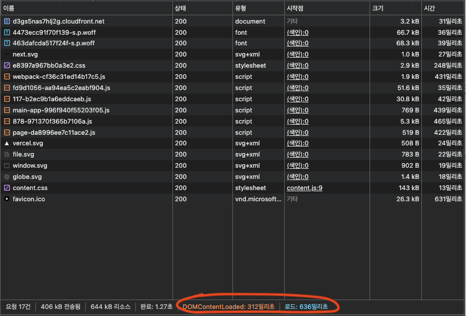

## 배포 다이어그램

GitHub Actions에 워크플로우는 다음과 같은 단계로 배포가 진행 됩니다.
1. 저장소를 체크아웃합니다.
2. Node.js 20 버전으로 설정합니다.
3. 프로젝트 의존성을 설치합니다.
4. Next.js 프로젝트를 빌드합니다.
5. AWS 자격 증명을 구성합니다.
6. 빌드된 파일을 S3 버킷에 동기화합니다.
7. CloudFront 캐시를 무효화합니다.

## 주요 링크
- S3 버킷 웹사이트 엔드포인트: http://front-3rd-chapter4.s3-website-us-east-1.amazonaws.com
- CloudFrount 배포 도메인 이름: https://d3gs5nas7hlj2g.cloudfront.net

## 주요 개념
- GitHub Actions과 CI/CD 도구: 
  - GitHub Actions은 빌드, 테스트 및 배포 파이프라인을 자동화할 수 있는 CI/CD 플랫폼이다.
  - 레포지토리에서 발생하는 push, pr등 이벤트를 트리거로 workflow를 구성 할 수 있다.
  - 현재 프로젝트 기준으로 GitHub Actions에서 제공하는 공식 액션을 활용해 AWS 클라우드 환경에 애플리케이션을 배포하는 CI/CD 워크플로우 구현이 가능하다.

- S3와 스토리지:
  - S3(Simple Storage Service)는 이미지, 문서 등 변하지 않는 정적 자산을 버킷에 저장하여 사용한다.
  - 한 버킷 당 10억 개 이상의 객체를 저장 할 수 있다. 즉, 파일 수 제한이 없다고 봐도 된다.
  - 중요한 데이터를 암호화 하거나 버킷 정책을 통해 안전하게 데이터를 관리 할 수 있다.

- CloudFront와 CDN:
  - CloudFront는 AWS에서 제공하는 CDN 서비스이다.
  - CDN은 가까운 서버에 콘텐츠를 캐싱하여 사용자들이 더 빠른 컨텐츠를 확인 할 수 있게 해준다.
  - 원본 서버에 요청을 줄여 비용절감에도 도움이 된다
  - 앳지 로케이션을 통해 사용자에게서 가까운 서버에서 콘텐츠를 제공하여 지연시간을 최소화 한다.
    - 유저가 콘텐츠를 요청
    - 엣지 로케이션을 통해 가까운 서버에 요청한 컨텐츠가 캐시에 저장되어 있는지 확인
    - 없다면 원본 서버에 컨텐츠를 요청
    - 있다면 가까운 서버에 캐시된 컨텐츠를 전달

- 캐시 무효화(Cache Invalidation):
  - 캐시 무효화는 CDN의 캐시된 콘텐츠를 갱신, 삭제하여 최신 데이터를 적절하게 제공하기 위해 중요한 단계이다.
  - CloudFront 같은 경우 CLI 명령어나 콘솔에서 와일드카드(/*)를 통해 캐시를 무효화 하거나 특정 경로를 무효화 할 수 있다.
  - 이미지나 정적 파일의 경우 파일 이름이나 URL에 정보를 추가하여 새로운 콘텐츠로 인식하게 하는 캐시 버스팅을 활용할 수 있다.
  

- Repository secret과 환경변수:
  - Repository secret는 민감한 정보를 안전하게 관리 할 수 있게 GitHub에서 제공하는 보안 기능이다.
  - 해당 정보는 GitHub Actions에서만 사용이 가능 하다
  - 현재 프로젝트 기준으로 AWS의 시크릿 키 등을 저장히여 안전하게 Actions를 통해 CI/CD 워크플로우를 구현 할 수 있다.

## CDN과 성능최적화
- S3

- CDN

모든 리소스를 다운로드 되는 시간을 1.57초 > 636밀리초로 약 **59.49%**를 단축
